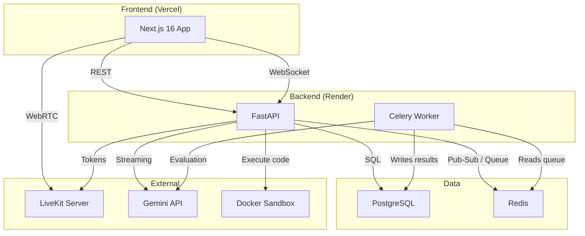

# InterviewLab

**Real-time AI-powered technical interview platform** — collaborative code editor, voice & video, AI evaluation, and screen sharing in one live session.

---

**Python** `3.11+` · **TypeScript** `5.0+` · **Gemini** `2.5 Flash` · **LiveKit** `1.0+` · **Next.js** `16` · **Status** `Portfolio-Project`

---

## What It Does

InterviewLab connects interviewers and candidates in a live technical interview room:

- **Interviewer** schedules a session, picks a coding problem, and invites a candidate
- **Candidate** joins via invite link or 6-character room code
- Both collaborate in a **shared Monaco code editor** (Yjs CRDT, live cursors, breakpoints)
- **Voice & video** via LiveKit WebRTC
- **AI assistant** (Gemini 2.5 Flash) streams answers during the session
- After the session ends, a **Celery worker** auto-generates a scored evaluation report

## High-Level Architecture



## Tech Stack

| Layer | Technology |
|-------|-----------|
| **Backend** | Python 3.11, FastAPI, SQLAlchemy (async), Alembic, asyncpg |
| **Queue** | Celery 5, Redis 7 |
| **Frontend** | Next.js 16 (App Router), React 19, TypeScript, Tailwind CSS 4 |
| **Real-time** | WebSocket, Yjs (CRDT), LiveKit WebRTC |
| **AI** | Google Gemini 2.5 Flash |
| **Database** | PostgreSQL 15 |
| **Code Execution** | Docker sandboxed containers |
| **Deployment** | Render (backend + Celery worker), Vercel (frontend) |
| **CI/CD** | GitHub Actions |

## Features

### Core
- JWT authentication — Candidate, Interviewer, Admin roles
- Resume upload with AI-powered extraction
- Coding problem library with AI generation (Gemini)
- Interview scheduling with candidate assignment
- Shared Monaco editor — Yjs CRDT, live cursors, instant sync
- Code execution in Docker sandboxed containers
- AI chat assistant (SSE streaming) during interviews
- AI cheating detection (tab switching, large paste events)
- Voice & video — LiveKit WebRTC
- Invite system — unique token link + 6-char room code
- Post-interview AI evaluation (technical, code quality, communication, problem-solving, overall)
- Analytics dashboard — skill progression charts, evaluation history

### Bonus Features
- **Queue Workers** — Celery + Redis; AI evaluation runs async, API returns 202 instantly
- **Screen Sharing** — `getDisplayMedia` + LiveKit screen track publishing
- **Load Balancing Simulation** — Redis heartbeat per instance, Admin dashboard with simulate-failure
- **Collaborative Debugging** — Yjs-synced breakpoints on Monaco gutter, per-author colors, inline comments

## Project Structure

```
InterviewLab/
├── src/
│   ├── api/v1/endpoints/     # auth, interviews, problems, ai, analytics, code, system, websocket
│   ├── models/               # User, Interview, Resume, Problem, AIEvaluation, ...
│   ├── services/             # AI service, orchestrator, code execution, resume parsing
│   ├── workers/              # Celery app + background tasks
│   └── core/                 # Database, config, security
├── frontend/
│   ├── app/                  # Next.js App Router pages
│   ├── components/           # UI components (interview room, editor, analytics, ...)
│   ├── hooks/                # useYjsEditor, useLiveKitRoom, ...
│   └── lib/                  # API clients, stores, utils
├── docs/                     # Architecture, API, deployment, user guide
├── nginx/                    # Load balancing config
├── docker-compose.yml
├── docker-compose.lb.yml     # Multi-instance load balancing
└── .github/workflows/        # CI/CD pipeline
```

## Quick Start

See [docs/LOCAL_DEVELOPMENT.md](docs/LOCAL_DEVELOPMENT.md) for full setup.

```bash
# Clone
git clone https://github.com/M0nGKol/SomPheas-AI-Interviewer
cd InterviewLab

# Backend
python -m venv .venv && source .venv/bin/activate
pip install -r requirements.txt
cp .env.example .env        # fill in DATABASE_URL, REDIS_URL, GEMINI_API_KEY, etc.
alembic upgrade head
uvicorn src.main:app --reload

# Celery worker (separate terminal)
celery -A src.workers.celery_app worker --loglevel=info

# Frontend
cd frontend && npm install
cp .env.local.example .env.local
npm run dev
```

## Deployment

Backend → Render, Frontend → Vercel. See [docs/DEPLOYMENT.md](docs/DEPLOYMENT.md).

## Documentation

| Doc | Description |
|-----|-------------|
| [docs/ARCHITECTURE.md](docs/ARCHITECTURE.md) | System design and component overview |
| [docs/API.md](docs/API.md) | REST API reference |
| [docs/DEPLOYMENT.md](docs/DEPLOYMENT.md) | Render + Vercel deployment guide |
| [docs/LOCAL_DEVELOPMENT.md](docs/LOCAL_DEVELOPMENT.md) | Local setup guide |
| [docs/FRONTEND.md](docs/FRONTEND.md) | Frontend architecture |
| [docs/USER_GUIDE.md](docs/USER_GUIDE.md) | End-user guide |
| [docs/NFRs.md](docs/NFRs.md) | Non-functional requirements |
