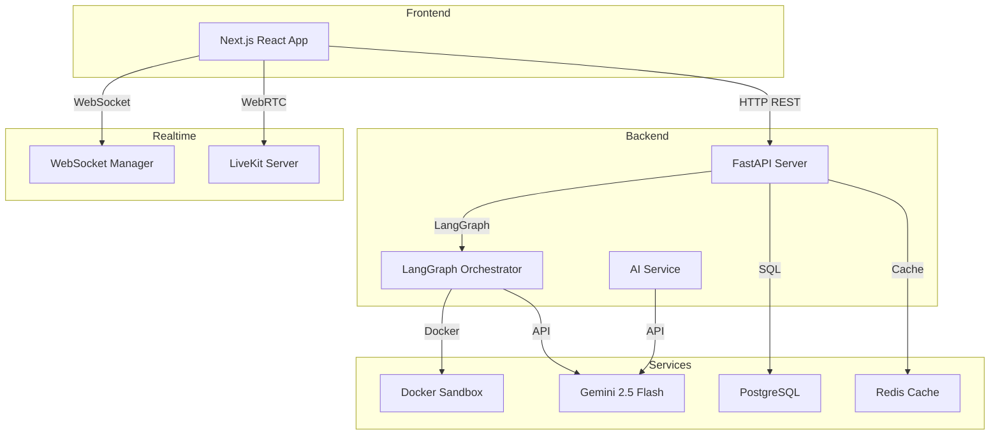
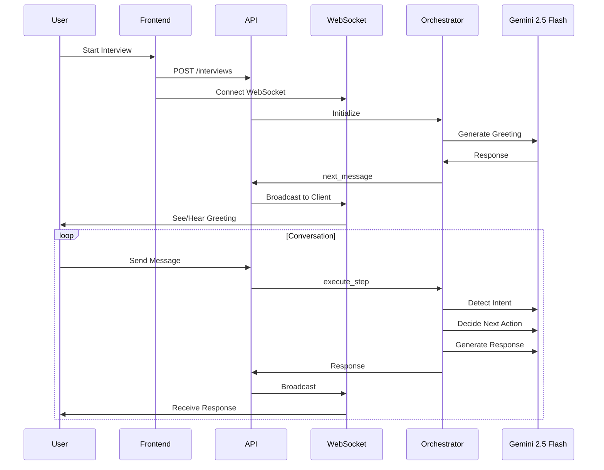

# SomPheas

**Problem:** Traditional technical interview practice often lacks realism, immediate feedback, and interactive engagement.

**Solution:** SomPheas delivers AI-driven technical interviews with real-time conversations, live code execution, and in-depth feedback, powered by Google Gemini and LangGraph.

---

**Python** `3.11+` **TypeScript** `5.0+` **LangGraph** `0.0.40+` **Gemini** `2.5 Flash` **LiveKit** `1.0+` **License** `GNU` **Status** `Portfolio-Project`

Portfolio Project — Production-ready codebase demonstrating AI system architecture.

## Aim

Provide candidates with realistic interview practice through:

- **Natural AI conversations** with a context-aware interviewer
- **Live code execution** in isolated sandbox
- **Comprehensive feedback** on communication, technical knowledge, problem-solving, and code quality
- **Resume-based questions** tailored to candidate background

## High-Level Architecture



### Core Components

| Component        | Technology        | Purpose                               |
| ---------------- | ----------------- | ------------------------------------- |
| **Orchestrator** | LangGraph         | State machine managing interview flow |
| **AI Service**   | Google Gemini     | Chat, code review, evaluation         |
| **LLM**          | Gemini 2.5 Flash  | Question generation, decision making  |
| **Sandbox**      | Docker            | Isolated code execution               |
| **Database**     | PostgreSQL        | Interview state, checkpoints          |
| **Cache**        | Redis             | State caching, session management     |
| **Realtime**     | WebSocket/LiveKit | Live session sync and video/audio     |

## How It Works

### Interview Flow



### State Management

- **LangGraph MemorySaver**: In-memory state per interview (`thread_id`)
- **Database Checkpoints**: Persistent state after each turn
- **Reducers**: Append-only fields (conversation_history, questions_asked)
- **Single Writer**: Critical fields (next_message, phase) written by one node

## Current Performance

### Strengths

- ✅ **Real-time sync** via WebSocket per interview room
- ✅ **State persistence** via checkpoints
- ✅ **Concurrent interviews** (isolated by thread_id)
- ✅ **Code execution** in isolated Docker containers
- ✅ **Comprehensive feedback** with skill breakdowns

## Project Structure

```
SomPheas/
├── src/                    # Backend (Python/FastAPI)
│   ├── api/               # REST API implementation
│   │   └── v1/
│   │       └── endpoints/ # Endpoints: interviews, resumes, ai, code, sandbox, websocket
│   ├── core/              # Configuration, database, and authentication utilities
│   ├── models/            # Database models for core entities
│   ├── schemas/           # Pydantic schemas for data validation
│   └── services/          # Business logic and subsystems
│       ├── ai/            # Gemini AI chat, code review, and evaluation
│       ├── analysis/      # Interview response and code analysis
│       ├── analytics/     # Analytics functionality
│       ├── data/          # Checkpointing and state management
│       ├── execution/     # Secure code sandboxing
│       ├── interviews/    # Interview business logic
│       ├── logging/       # Interview activity logging
│       ├── orchestrator/  # State orchestration using LangGraph
│       └── websocket/     # Real-time connection management
├── frontend/              # Frontend (Next.js + React)
│   ├── app/              # App routing and authentication
│   ├── components/       # UI components (interview, analytics, UI kit)
│   ├── lib/              # API client and store utilities
│   └── hooks/            # Custom React hooks
├── docs/                  # Documentation and guides
├── alembic/               # Database migration scripts
├── docker-compose.yml     # Local dev orchestration
├── Dockerfile             # Production build configuration
└── pyproject.toml         # Backend dependencies and settings
```

## Documentation

- [Architecture](docs/ARCHITECTURE.md) - System architecture and component relationships
- [API Reference](docs/API.md) - REST API endpoints
- [Frontend](docs/FRONTEND.md) - Next.js frontend architecture and development
- [User Guide](docs/USER_GUIDE.md) - How to use SomPheas
- [Local Development](docs/LOCAL_DEVELOPMENT.md) - Setup and development workflow
- [LangGraph Guide](docs/LANGGRAPH.md) - State, nodes, and orchestration
- [Deployment](docs/DEPLOYMENT.md) - Railway and Vercel deployment

## Quick Start

```bash
# Backend
uvicorn src.main:app --reload

# Frontend
cd frontend
npm install
npm run dev
```

See [Local Development](docs/LOCAL_DEVELOPMENT.md) for detailed setup.

## Tech Stack

### Backend

- **FastAPI** - Modern async web framework
- **Python 3.11+** - Programming language
- **LangGraph** - State machine orchestration
- **SQLAlchemy 2.0+** - ORM with async support
- **Alembic** - Database migrations
- **Google Gemini 2.5 Flash** - LLM for AI conversations and evaluation
- **google-genai** - Official Gemini SDK
- **LiveKit** - Real-time video/audio infrastructure
- **PostgreSQL** - Primary database
- **Redis** - Caching and state management
- **Docker** - Code sandbox execution

### Frontend

- **Next.js 16.1** - React framework
- **TypeScript 5.0+** - Type safety
- **React 19.2** - UI library
- **Tailwind CSS 4** - Styling
- **Zustand** - State management
- **TanStack Query** - Data fetching
- **Monaco Editor** - Code editor
- **Framer Motion** - Animations
- **LiveKit Client** - WebRTC integration

### Deployment

- **Railway** - Backend hosting
- **Vercel** - Frontend hosting

## License

GNU General Public License v3.0
