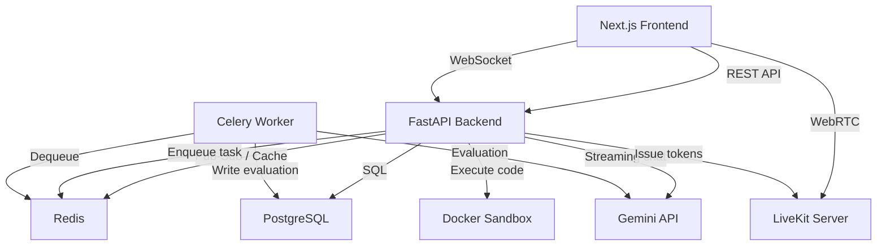
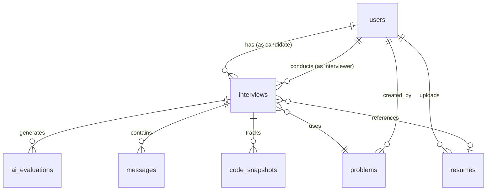

# InterviewLab Architecture

## System Overview

InterviewLab is a real-time technical interview platform. An interviewer and candidate join a shared live room with a collaborative code editor, voice/video, and an AI assistant. After the session, a background worker evaluates the candidate automatically.



---

## Core Components

### 1. FastAPI Backend (`src/`)

Async REST + WebSocket server. All DB and I/O operations use `async/await` with `asyncpg`.

**API groups (`src/api/v1/endpoints/`):**

| Router | Prefix | Responsibility |
|--------|--------|----------------|
| `auth` | `/auth` | Register, login, JWT |
| `interviews` | `/interviews` | CRUD, invite, start, end |
| `problems` | `/problems` | Problem library + AI generation |
| `ai` | `/ai` | Streaming chat, trigger evaluation |
| `analytics` | `/analytics` | Skill scores, evaluation history |
| `code` | `/code` | Sandboxed code execution |
| `system` | `/system` | Node heartbeats, admin dashboard |
| `websocket` | `/ws` | Real-time collaboration channel |

### 2. Real-Time Collaboration

WebSocket connections are scoped per interview room. Messages fan out via **Redis pub-sub** so multiple API instances stay in sync.

Yjs (CRDT) handles the shared document state:
- Code editor content — synced via `y-monaco`
- Live cursors — per-user awareness protocol
- Breakpoints — `Y.Map<string>` shared across participants
- Binary Yjs state stored in PostgreSQL (`yjs_state` column) so late-joining users get full document history instantly

### 3. Celery Worker (`src/workers/`)

Handles AI evaluation as a background task so the interview ends immediately without blocking.

```
POST /ai/evaluate  →  evaluate_interview_task.delay(interview_id)  →  202 Accepted
                                    ↓
                          Celery worker picks up task
                                    ↓
                     Calls Gemini, saves AIEvaluation row
                                    ↓
                        Interview status → COMPLETED
```

Falls back to synchronous evaluation if Celery is unavailable.

### 4. AI Service (`src/services/`)

- **Chat** — streams Gemini responses via SSE during the interview
- **Evaluation** — sends full conversation history + code snapshots to Gemini, receives structured scores (technical, code quality, communication, problem-solving, overall)
- **Problem generation** — generates coding problems from a prompt
- **Resume extraction** — parses uploaded PDFs and extracts structured candidate data

### 5. Code Execution (`src/services/execution/`)

Runs candidate code inside isolated Docker containers with:
- Per-language images (Python, JavaScript, Java, Go, C++)
- Timeout enforcement
- Stdout/stderr capture
- No network access inside container

### 6. LiveKit Integration

- Issues room tokens from `POST /interviews/{id}/livekit-token`
- Frontend uses `@livekit/components-react` for voice/video UI
- Screen sharing: `getDisplayMedia()` → publish as `Track.Source.ScreenShare`
- Screen track published to all room participants automatically

### 7. Load Balancing Simulation

Each API instance writes a heartbeat to Redis every request:

```
SET node:heartbeat:{INSTANCE_ID}  {json}  EX 30
```

`GET /system/nodes` reads all `node:heartbeat:*` keys. `POST /system/nodes/{id}/kill` deletes the key, removing the node from the pool. The Admin dashboard polls every 5 seconds.

---

## Data Flow: Interview Session

```
1. Interviewer creates interview → POST /interviews
2. Interviewer invites candidate → POST /interviews/{id}/invite  (generates invite_token)
3. Candidate opens invite link → GET /join/{inviteCode} → POST /interviews/{id}/join
4. Both request LiveKit tokens → POST /interviews/{id}/livekit-token
5. Both connect to WebSocket → WS /ws/{interview_id}
6. Yjs syncs editor state → Redis pub-sub fans out to all connections
7. AI chat → POST /ai/chat (SSE stream)
8. Code run → POST /code/execute (Docker)
9. Interview ends → POST /interviews/{id}/end
10. Evaluation task queued → Celery worker picks up, saves AIEvaluation
```

---

## Database Schema



| Table | Key Columns |
|-------|-------------|
| `users` | id, email, hashed_password, role, is_active |
| `resumes` | id, user_id, file_path, extracted_data (JSON), analysis_status |
| `problems` | id, title, description, difficulty, language, starter_code, test_cases |
| `interviews` | id, user_id, interviewer_id, problem_id, status, language, current_code, yjs_state, invite_token, room_code, conversation_history (JSON) |
| `ai_evaluations` | id, interview_id, technical_score, code_quality_score, communication_score, problem_solving_score, overall_score, strengths (JSON), weaknesses (JSON), feedback_summary |
| `messages` | id, interview_id, role, content, created_at |
| `code_snapshots` | id, interview_id, code, language, created_at |
| `sandbox_sessions` | id, interview_id, container_id, language, status |
| `session_events` | id, interview_id, event_type, data (JSON), created_at |

---

## Security

- **JWT** — HS256 tokens, 30-minute expiry, injected via Axios interceptors on the frontend
- **Role-based access** — CANDIDATE, INTERVIEWER, ADMIN enforced per endpoint
- **Docker sandboxing** — code execution isolated with no network, resource limits
- **WebSocket auth** — token validated on connection upgrade
- **Deploy hooks** — Render deploy keys scoped per service, stored as GitHub Actions secrets
