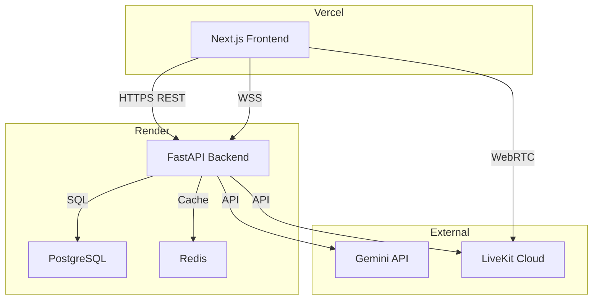

# Deployment Guide

SomPheas deploys as two services:

- **Render** — FastAPI backend (runs migrations + API on start)
- **Vercel** — Next.js frontend



---

## Render (Backend)

### Prerequisites

- [Render account](https://render.com)
- GitHub repo connected to Render

### Step 1 — Deploy via render.yaml (Blueprint)

The `render.yaml` at the repo root defines all three services (API, PostgreSQL, Redis) in one file.

1. Go to **Render dashboard → New → Blueprint**
2. Connect your GitHub repository
3. Render detects `render.yaml` and creates all services automatically

This provisions:
- `sompheas-api` — Docker-based web service
- `sompheas-db` — PostgreSQL database
- `sompheas-redis` — Redis instance

### Step 2 — Set Secret Environment Variables

`render.yaml` marks secrets as `sync: false` — you must set these manually after the blueprint deploys.

In **Render dashboard → sompheas-api → Environment**, fill in:

| Variable             | Value                                | Where to get it                                 |
| -------------------- | ------------------------------------ | ----------------------------------------------- |
| `GEMINI_API_KEY`     | Your Gemini API key                  | [Google AI Studio](https://aistudio.google.com) |
| `LIVEKIT_URL`        | `https://your-project.livekit.cloud` | [LiveKit Cloud](https://cloud.livekit.io)       |
| `LIVEKIT_WS_URL`     | `wss://your-project.livekit.cloud`   | LiveKit Cloud                                   |
| `LIVEKIT_API_KEY`    | LiveKit API key                      | LiveKit Cloud                                   |
| `LIVEKIT_API_SECRET` | LiveKit API secret                   | LiveKit Cloud                                   |

Everything else (`DATABASE_URL`, `REDIS_URL`, `SECRET_KEY`) is auto-set by `render.yaml`.

### Step 3 — Trigger First Deploy

After setting the secrets, click **Manual Deploy → Deploy latest commit** on the `sompheas-api` service.

Migrations run automatically before the server starts (`alembic upgrade head` is baked into the start command).

### Step 4 — Note Your API URL

Render assigns a public URL: `https://sompheas-api.onrender.com`

You'll need this for the frontend env vars.

### Step 5 — Verify

```bash
curl https://sompheas-api.onrender.com/health
# {"status": "healthy"}
```

---

## Vercel (Frontend)

### Prerequisites

- [Vercel account](https://vercel.com)
- Vercel CLI: `npm i -g vercel`

### Step 1 — Import the Repo

1. Go to [vercel.com/new](https://vercel.com/new)
2. Import your GitHub repository
3. Set **Root Directory** to `frontend`

Vercel auto-detects Next.js — no build command changes needed.

### Step 2 — Set Environment Variables

In **Vercel dashboard → your project → Settings → Environment Variables**, add:

| Variable              | Value                                    | Environment |
| --------------------- | ---------------------------------------- | ----------- |
| `NEXT_PUBLIC_API_URL` | `https://sompheas-api.onrender.com`      | Production  |
| `NEXT_PUBLIC_WS_URL`  | `wss://sompheas-api.onrender.com`        | Production  |

Both point to the same Render domain — just different protocols.

### Step 3 — Deploy

```bash
cd frontend
vercel --prod
```

Or push to `main` — Vercel auto-deploys on every push.

---

## LiveKit Setup

Sign up at [cloud.livekit.io](https://cloud.livekit.io), create a project, and copy:

- **URL** → `LIVEKIT_URL` and `LIVEKIT_WS_URL`
- **API Key** → `LIVEKIT_API_KEY`
- **API Secret** → `LIVEKIT_API_SECRET`

---

## Troubleshooting

| Symptom                           | Fix                                                                   |
| --------------------------------- | --------------------------------------------------------------------- |
| Deploy fails at migration step    | Check `DATABASE_URL` is set and PostgreSQL service is healthy         |
| `500` on any endpoint             | Check Render logs: dashboard → sompheas-api → Logs                   |
| Frontend can't reach API          | Verify `NEXT_PUBLIC_API_URL` matches Render domain (no trailing `/`)  |
| WebSocket disconnects immediately | Verify `NEXT_PUBLIC_WS_URL` uses `wss://`, not `https://`             |
| Gemini calls fail                 | Verify `GEMINI_API_KEY` is valid and `GEMINI_MODEL` is set            |
| LiveKit room creation fails       | Verify all three LiveKit env vars are set correctly                   |
| Service spins down (free tier)    | Render free tier sleeps after 15 min inactivity — upgrade to Starter  |
