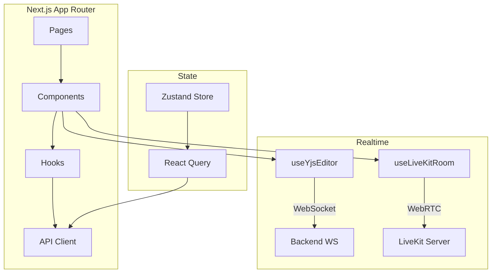

# Frontend Documentation

## Overview

InterviewLab frontend is a Next.js 16 (App Router) application built with TypeScript, React 19, and Tailwind CSS 4. It provides the full interview experience — scheduling, live collaboration, voice/video, and analytics.

## Architecture



## Tech Stack

| Technology | Version | Purpose |
|-----------|---------|---------|
| **Next.js** | 16 (App Router) | Framework, routing |
| **React** | 19 | UI library |
| **TypeScript** | 5+ | Type safety |
| **Tailwind CSS** | 4 | Styling |
| **Zustand** | 5 | Auth + global state |
| **TanStack Query** | 5 | Server state, caching |
| **Yjs** | 13.x | CRDT real-time sync |
| **y-monaco** | 0.1.x | Yjs ↔ Monaco binding |
| **@monaco-editor/react** | 4.x | Code editor |
| **@livekit/components-react** | 2.x | Voice/video UI |
| **livekit-client** | 2.x | WebRTC client |
| **Framer Motion** | 11 | Animations |
| **Recharts** | 2 | Analytics charts |
| **Axios** | 1.x | HTTP client |
| **React Hook Form + Zod** | latest | Forms + validation |

## Page Structure

```
app/
├── page.tsx                          # Landing page
├── (auth)/
│   ├── login/page.tsx
│   └── register/page.tsx
├── dashboard/
│   ├── page.tsx                      # Role-based redirect
│   ├── candidate/page.tsx            # Candidate dashboard
│   ├── interviewer/page.tsx          # Interviewer dashboard
│   ├── interviews/
│   │   ├── page.tsx                  # Interview list
│   │   ├── new/page.tsx              # Create interview
│   │   └── [id]/page.tsx            # Interview detail
│   ├── problems/
│   │   ├── page.tsx
│   │   ├── new/page.tsx
│   │   └── [id]/page.tsx
│   ├── analytics/page.tsx            # Skill charts
│   ├── sandbox/page.tsx              # Code sandbox
│   └── system/page.tsx              # Admin: node health (ADMIN only)
├── interview/[sessionId]/page.tsx    # Live interview room
├── join/[inviteCode]/page.tsx        # Candidate join via invite
└── resumes/
    ├── page.tsx
    └── [id]/page.tsx
```

## Key Components

### InterviewRoom (`components/interview/InterviewRoom.tsx`)
The main live session component. Manages:
- Shared Monaco editor via `useYjsEditor`
- Debug mode toggle + breakpoint panel
- Screen share (`getDisplayMedia` + LiveKit track publish)
- AI chat panel (SSE stream)
- Voice/video panel

### useYjsEditor (`hooks/use-yjs-editor.ts`)
- Creates a Yjs `Doc` and connects via WebSocket provider
- Binds `y-monaco` to the Monaco editor instance
- Exposes `yBreakpoints: Y.Map<string>` for collaborative debugging
- Returns `bind(editor, monaco)` to attach to the editor on mount

### useLiveKitRoom (`hooks/use-livekit-room.ts`)
- Connects to LiveKit server with a token from the backend
- Manages connection state, participant tracking
- Handles disconnect reason casting for TypeScript compatibility

### DebugPanel (`components/interview/DebugPanel.tsx`)
- Listens to `yBreakpoints.observe` and renders Monaco gutter decorations
- Click any line number to add/remove a breakpoint
- Each breakpoint has: line, author, optional comment, author color
- All state syncs via Yjs — both participants see changes instantly

### VoiceVideoSimple (`components/interview/voice-video-simple.tsx`)
- Renders local and remote audio/video tracks from LiveKit
- Handles track subscription, mute state, and device selection

## State Management

**Zustand (`lib/store/auth-store.ts`)** — persists auth token and user info in memory.

**React Query** — all API calls go through typed query/mutation hooks in `lib/api/`. Handles caching, background refetch, and optimistic updates.

## API Client (`lib/api/`)

Axios instance with:
- Base URL from `NEXT_PUBLIC_API_URL`
- `Authorization: Bearer <token>` injected automatically
- 401 responses → redirect to `/login`

Files:
- `auth.ts` — register, login, me
- `interviews.ts` — CRUD, invite, start/end, LiveKit token
- `problems.ts` — library, generate
- `analytics.ts` — overview, per-interview scores
- `system.ts` — node list, kill node

## Environment Variables

```env
NEXT_PUBLIC_API_URL=https://your-api.onrender.com
NEXT_PUBLIC_WS_URL=wss://your-api.onrender.com
```

## Scripts

```bash
npm run dev       # Start dev server on port 3000
npm run build     # Production build
npm run start     # Start production server
npm run lint      # ESLint on app/, components/, lib/, hooks/
npx tsc --noEmit  # Type check only
```
